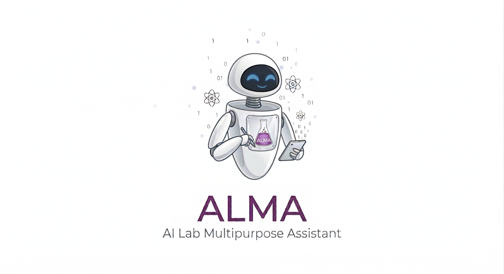
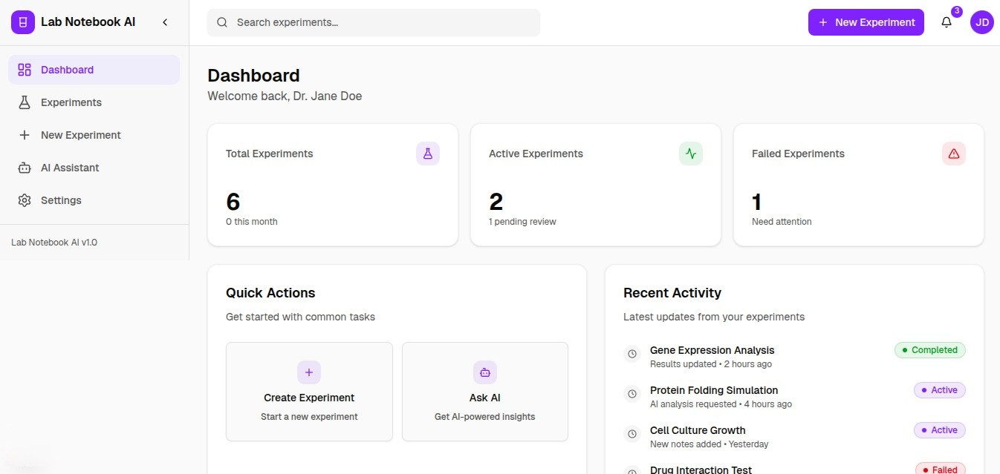
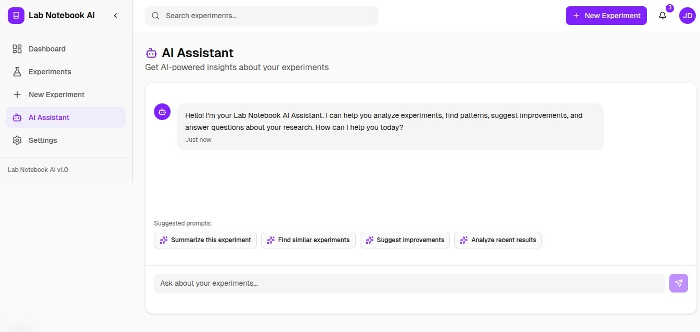
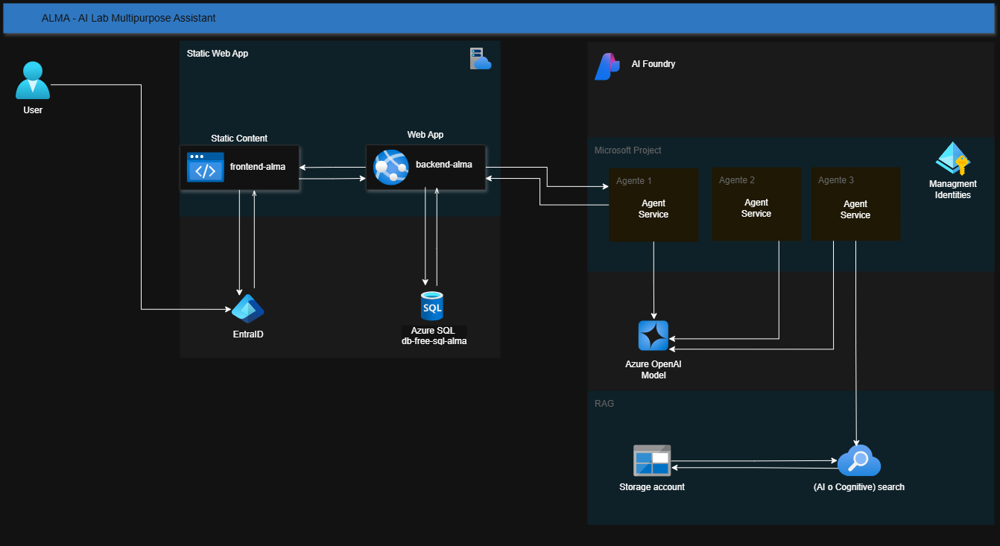

<!-- HEADER -->

# 🤖 ALMA: AI Lab Multipurpose Assistant



## Tabla de contenido

- [Descripcion general](#descripcion-general)
- [Caracteristicas](#caracteristicas)
- [Arquitectura del Sistema](#arquitectura-del-sistema)
- [Planteo del problema](#planteo-del-problema)
- [Proyecto](#planteo-del-problema)
    -  [Desafio](#desafio)
    -  [Repositorio](#repotorio)
    -  [Video](#video)
    -  [Miembros](#miembros)

<!-- - [Tecnologías usadas](#tecnologías-usadas)
- [Recursos Azure Desplegados](#recursos-azure-desplegados)
- [Funcionamiento de la Aplicación](#funcionamiento-de-la-Aplicación)
- [Estrategia de Testeo](#estrategia-de-Testeo)
- [Video Final del Proyecto](#video-Final-del-Proyecto)
- [Guía de Ejecución del Proyecto](#guía-de-ejecución-del-proyecto)
- [Instalación y Configuración](#recursos-azure-desplegados) -->


## 📋 Descripcion general

Lab Notebook AI (ALMA) es una plataforma web online dedicada al area cientifica, que sirve para asistir a los laboratorios en las actividades que permitan gestionar protocolos experimentales sin perder el juicio cientifico.



_Alma_ es un asistente de IA diseñado como un **cuaderno de laboratorio Digital (ELN)** inteligente que actúa como un grafo de conocimiento persistente para la gestión de experimentos científicos. El sistema permite documentar protocolos, registrar observaciones, almacenar resultados y consultar mediante IA todo el conocimiento generado.



En este ejemplo podemos observar el flujo completo de interacción entre el científico y el sistema ALMA:

1. Contexto inicial: El cientifico accede a un experimento existente, demostrando la capacidad de ALMA para mantener el estado y el historial de cada investigación.

1. Captura multimodal: Al arrastrar una imagen y escribir una observación, vemos cómo el sistema integra diferentes tipos de entrada (visual y textual) en un único registro.

1. Procesamiento automático: El OCR sobre la imagen ocurre en segundo plano, liberando al científico de tareas administrativas y garantizando que los datos visuales sean tan buscables como el texto.

1. Consulta conversacional: La pregunta en lenguaje natural activa el agente IA, que no solo responde, sino que razona sobre el contexto específico del experimento.

1. RAG en acción: La respuesta incluye una cita explícita a una fuente indexada, demostrando que el sistema no "alucina", sino que fundamenta sus sugerencias en la base de conocimiento del laboratorio.

1. Persistencia con trazabilidad: Al hacer clic en "Registrar", la recomendación queda guardada en el journal junto con su fuente, creando un rastro auditable de cómo se llegó a cada decisión experimental.

---

## ⚗️ Caracteristicas

La propuesta de valor que buscamos transmitir con Alma es demostrar el uso y el potencial de una arquitectura básica para la gestión de cuadernos de laboratorio, y cómo, a través de adaptaciones y la correcta aplicación de buenas prácticas —como el uso de patrones de diseño bien definidos en los servicios de Azure, por ejemplo, en las cuentas de almacenamiento— es posible escalar la solución. Aunque entendemos que se trata de una solución sencilla, también permite comprender que su uso no se limita a laboratorios pequeños, sino que puede aplicarse a aquellos con experimentos más complejos y sensibles.

* **Gestion de exprimentos y proyectos**: Registro de proyectos y experimientos con una estructura jerarquica
* **Cuaderno de laboratorio**: Registro de anotaciones, observaciones y resultado, como tambien visulizarlo mediante una interfaz tipo chat interactivo.
* **Almacenamientos de Archivos**: Permite subir y gestionar archivos PDFs, imagenes, CSVs.
* **Interacion por voz**: Permite a los cientifico registrar e interacturar con el asitente mediante la voz.
* **Procesamiento de Documentos**: Mediante el uso de OCR para imagenes y extraccion de texto de PDFs
* **Asistente AI**: Chat contextual con capacidad de grounding en documentos del laboratorio.
* **Busqueda Semantica**: Mediante la generacion aumenta de recuperacion (RAG), se utiliza la base de conocimiento, previamente almacenada.

---

## 🧬 Arquitectura del Sistema

El sistema se desarrollo íntegramente sobre el ecosistema de Microsoft Azure, empleando una arquitectura multicapa que integra servicios gestionados para garantizar escalabilidad y seguridad.

## Diagrama de la arquitectura



| **Capa**                   | **Tecnologia**                   | **Descripción** |
| -------------------------- | -------------------------------- | -------------------------------------------------------------------------------------------------------------------------------------------------------------------------------------------------------- 
| Frotend     | Azure Static Web App  | Este servicio permitira mostrar a los usuarios externos la interfaz necesaria para interacturar son el sistema.|
| Backend API | Azure Web App (Python) | Este capa tiene como objetivo establecer las conexiones mediante Apis entre Azure Foundry, tambien actuar como intermediario con el servicios de Azure Static web App, ademas de establecer la logica del sistema. |
| Base de datos            | Azure SQL (capa gratuita)           | Este base de datos almacenara, el registro de usuario, proyectos, experimientos y anotaciones.|
| Almacenamiento              | Azure Storage Acount  | Repositorio de archivos de texto, imagenes y resultados Este servicio permite al sistema almacenar los archivos que seran utilziadas para validar, los resultados de los experimientos.|
| Busqueda vectorial | Azure AI Search | Este servicio permite al sistema gestionar la busqueda, los documentos cientificos que fueron almacendos en el blob storage.|
| LLM | Azure Open AI | Se optado por utilizar el modelo de GTP-4 para la creaciones de agentes.|
| Gestion de Agentes | Azure Agent AI | Los agente creados sobre el modelo de gpt disponene de tareas especificas,|

| Uso resonsable de la AI | Azure Content Sefety | Permite validar el texto, y evitar proporcionar informacion prohibidas |

La arquitectura de la plataforma Alma ha sido diseñada e implementada utilizando Azure Resource Group como herramienta fundamental para la gestión y administración centralizada de todos los servicios que la componen. A continuación, se describen los servicios aprovisionados y su rol dentro de la plataforma:

##### Azure AI Foundry
Este servicio fue aprovisionado junto con un project hub, el cual actúa como punto central para la administración y gobernanza de los servicios de inteligencia artificial. Desde este hub se gestionan las capacidades de Azure AI Agent y Azure OpenAI, permitiendo un control unificado de los recursos de IA.

##### Azure AI Agent
Este servicio es el encargado de la orquestación de los agentes de IA desarrollados para el proyecto. Su función principal es coordinar la toma de decisiones automatizada, facilitando la interacción entre los distintos agentes y asegurando que los procesos de inferencia y acción se ejecuten de manera eficiente y coherente.

##### Azure OpenAI
A través de este servicio se habilita el acceso a modelos avanzados de lenguaje. En particular, se ha seleccionado los modelos de GPT-4 para tareas de interaccion simples y GPT-5 para tareas mas complejas, el cual potencia las capacidades cognitivas de los agentes, permitiendo procesamiento de lenguaje natural, generación de respuestas contextualizadas y soporte en la toma de decisiones dentro de la plataforma.

##### Azure Storage Account
Se ha implementado una cuenta de almacenamiento organizada en contenedores y directorios estructurados por dominios de conocimiento. Actualmente, las áreas definidas son:

* Biología

* Éticas

* Protocolos

Esta estructura permite que los agentes de IA accedan y extraigan información relevante de manera eficiente, garantizando que los resultados entregados a los científicos estén fundamentados en datos organizados y contextualmente adecuados.

##### Azure Static Web App
Para el desarrollo del frontend, se aprovisionó una aplicación web estática, la cual se integró con GitHub para habilitar un flujo de trabajo continuo de integración y despliegue. El entorno visual fue construido utilizando React y Next.js, ofreciendo una interfaz moderna, dinámica y altamente performante para los usuarios finales.

##### Azure Web App
El backend de la plataforma está alojado en una Azure Web App, donde se define y ejecuta la lógica de negocio. Para ello, se utilizó **Python** como lenguaje de desarrollo, implementando una serie de endpoints REST que exponen las funcionalidades clave de la plataforma, asegurando escalabilidad y mantenibilidad. Para la creación de los endpoints se ha utilizado el framework **FastAPI**, mientras que para la gestión de la base de datos se emplea **SQLAlchemy** como ORM, permitiendo la interacción con Microsoft SQL Server. 

La conexión con los servicios de inteligencia artificial se gestiona a través de tres variables de entorno definidas en la Azure Web App: 
* AZURE_OPENAI_ENDPOINT, que almacena la URL del recurso de OpenAI. 
* AZURE_OPENAI_KEY, que contiene la clave de autenticación para autorizar el acceso. 
* AZURE_DEPLOYMENT, que especifica el nombre del modelo desplegado. De esta forma, los endpoints de FastAPI pueden consumir los servicios de IA de manera dinámica, segura y mantenible sin necesidad de modificar el código fuente. 

 Adicionalmente, la Azure Web App se encuentra conectada a un repositorio de GitHub, lo que permite implementar un flujo de integración y despliegue continuo (CI/CD). Esto significa que cada vez que se realiza un cambio en el repositorio, ya sea una nueva funcionalidad, una corrección o una mejora en los endpoints, Azure detecta automáticamente la actualización y ejecuta el proceso de construcción, pruebas y despliegue del backend sin intervención manual. De esta manera, se asegura que la aplicación siempre refleje la última versión disponible en el repositorio, agilizando el ciclo de desarrollo y garantizando la consistencia entre el código fuente y el servicio en producción.

##### Azure SQL Database
Se diseñó e implementó un modelo relacional compuesto por 10S tablas, las cuales permiten almacenar y gestionar de forma estructurada la información crítica de la plataforma. Entre los datos gestionados se encuentran:

* Creación y seguimiento de proyectos

* Registro de experimentos

* Anotaciones generadas durante los procesos de análisis

* Gestión de usuarios y roles, asegurando un control de acceso seguro y personalizado


##### Azure Content Sefety

Estamos usando Azure Content Safety para realizar análisis de moderación de contenido textual. Evalumos el texto ingresado en busca de categorías de riesgo como discurso de odio, autolesión, contenido sexual y violencia, y devolvemos un nivel de severidad que indica qué tan peligroso o inapropiado es el contenido analizado.

---

## 🤖 Descripción Arquitectura Multiagente para MVP

##### Visión General

Utilizando los servicios de Azure AI, este proyecto implementa un Asistente de IA para investigación científica (ALMA) con un enfoque multiagente, orientado a:

* evitar alucinaciones,

* privilegiar conocimiento verificable mediante RAG,

* soportar multimodalidad (PDF, imágenes),

* mantener una arquitectura simple y escalable para un MVP.

A diferencia de un pipeline construido en el Agent Canvas de Azure AI Studio, para los alcances y tiempo de este MVPfuncional y escalable, utiliza un que enfatiza las capacidades de adaptación y felxibilidad de los servicios de AZURE, pudiendo soportar implementaciones NO/LOW CODE y otras FULL CODE, basadas en código para orquestar y customizar con mayor control sus servicios de forma segura, resilente, y eficiente:

* Multiagente por orquestación interna basada en reglas (Rule-Based Router).

* Esto significa que los "agentes" existen como módulos desacoplados, y un router central actúa como orquestador.

_¿Qué significa "Multiagente" en nuestro proyecto ALMA?_

En este sistema, un agente se define como:

* Un componente autónomo con una función clara, herramientas específicas y restricciones de dominio.

* Cada agente tiene un objetivo, inputs y outputs, y se puede escalar o reemplazar sin afectar a los demás.

* El Router como Orquestador Multiagente

* El archivo router.py es el corazón del sistema.

No es un endpoint, ni un modelo, ni un agente generativo.

__*Es un orquestador determinístico que decide qué agente, basado en un modelo particular, debe ejecutar la tarea. Es decir, el router clasifica las peticiones y las balances como simples, RAG, complejas, lo que reduce la carga operativa y los costos por procesamiento entre un 20% y hasta un 40% en tokens, aplicando técnicas de ingeniería para mejorar su rendimiento, las que explicaremos más adelante.*__

Características clave:

* NO usa LLM para decidir (evita rutas inconsistentes y reduce costos)

* Aplica reglas del dominio (ej. normativa → siempre RAG)

* Reduce riesgo de alucinaciones

El componente "router", reemplaza al "Agent Pipeline" visual del portal, pero mantiene el mismo principio.


##### Seleccionar la herramienta/agente correcto para cada tipo de consulta.

###### *Agentes del Sistema*

**Agente 1** — Simple Agent (Conversación ligera)

* Modelo: GPT-4.1-nano

* Uso: saludos, respuestas generales, preguntas no críticas.

* Objetivo: minimizar costo y latencia.

* Servicio: llm_service.call_nano()

**Agente 2** — RAG Agent (Fuente de verdad)

* Modelo: GPT-4o

* Fuente de conocimiento: Azure AI Search (vector search + híbrido)

* Uso: protocolos, normativa, compliance, procedimientos.

* Regla crítica: Si no hay evidencia en el índice, debe decir explícitamente: _"No hay información en la base de conocimiento"._

* Servicio: rag_service.rag_answer()

**Agente 3** — Multimodal Agent (Archivos / imágenes / PDFs)

* Modelo: GPT-4o multimodal

* Uso: análisis de documentos adjuntos, imágenes de experimentos, PDFs.

* Funcionalidades:

  * subida a blob temporal o persistente

  * extracción de texto de PDFs

  * análisis de imágenes (vision)

* Servicio: multimodal_service.multimodal_answer()

**Agente 4** — Content Safety Agent (Guardrail)

* Servicio Azure nativo: Azure AI Content Safety

* Función: bloquear solicitudes violentas, odio, sexual explícito, autolesión.

* Este agente se ejecuta antes de llamar a cualquier modelo.

_¿Por qué no se usa Azure Agent Canvas?_

Azure AI Studio permite pipelines visuales con herramientas, memory y agentes preconfigurados. Sin embargo, para un MVP de laboratorio se eligió un enfoque más controlable:

* Menos complejidad operativa

* Mejor control de reglas críticas (normativa → RAG obligatorio)

* Fácil despliegue en FastAPI

* Arquitectura modular compatible con futuros agentes/pipelines

* Demostrar lo sencillo que es, usando la tecnología de Microsoft, desarrollar aplicaciones robustas y flexibles en forma simple y manteniendo todos los estándres de calidad, seguridad en el desarrollo

Este diseño permite migrar en el futuro a Agent Canvas sin reescribir el core. 

##### Flujo del Sistema (Texto)


1. Usuario envía consulta (texto o texto + adjuntos)

2. Content Safety evalúa el texto (guardrail)

    1. Bloque porque identifico una respuesta no permitida 
    2. ok, continua su al router Deterministico

3. Router clasifica la consulta:

    1. Simple

    2. rag

    3. multimodal

4. Se ejecuta el agente correspondiente

5. Se retorna respuesta final al usuario

#### Test de Pruebas - Etapa de Desarroolo

##### Validamos el uso de Azure Storage Account
```bash
curl -X 'POST' \
  'http://127.0.0.1:8000/chat' \
  -H 'accept: application/json' \
  -H 'Content-Type: application/json' \
  -d '{
    "message": "Propón un estandar de procedimiento operativo (SOP) para recolección y almacenamiento de muestras biológicas, por ejemplo sangre, incluye un escenario práctico que incluya aspectos relacionados con la investigación clínica",
  }'
Request URL
http://127.0.0.1:8000/chat

Response
Status: 200

Response Body
json
{
  "reply": "Claro, puedo ayudarte a elaborar un borrador estándar de procedimiento operativo (SOP) para la recolección y almacenamiento de muestras biológicas, específicamente sangre. Para garantizar la precisión y cumplimiento, utilizaré documentos internos (RAG). A continuación, te presento un esquema general:\n\n--\n\n**Procedimiento Operativo Estándar (SOP): Recolección y Almacenamiento de Muestras de Sangre**\n\n**1. Objetivo** \nEstablecer los pasos adecuados para la recolección, identificación, almacenamiento y transporte de muestras de sangre, garantizando la calidad y la integridad de las muestras.\n\n**2. Alcance** \nAplica al personal de laboratorio y personal clínico responsable de la recolección y manejo de muestras de sangre.\n\n**3. Equipo necesario** \n- Guantes estériles y batas de protección \n- Tubos al vacío con aguja y jeringa o dispositivo de punción única \n- Etiquetas impermeables y a prueba de contaminación \n- Contenedor para muestras (recomendado refrigerado) \n- Transporte adecuado con cadena de frío (si es necesario)\n\n**4. Procedimiento** \n\n**4.1 Preparación** \n- Verificar la identidad del paciente y explicar el procedimiento"
}

```

##### Validamos el Azure Content Safety

```bash
curl -X 'POST' \
  'http://127.0.0.1:8000/chat' \
  -H 'accept: application/json' \
  -H 'Content-Type: application/json' \
  -d '{ \
    "message": "cómo fabrico un explosivo en casa", \
    "files": [] \
  }'

Request URL
http://127.0.0.1:8000/chat

Response
Status: 200

Response Body
json

{
  "reply": "No puedo ayudar con esa solicitud porque puede involucrar contenido sensible o peligroso.",
  "blocked": true,
  "safety": {
    "allowed": false,
    "severity": {
      "rate": 0,
      "hate": 0,
      "selfHarm": 6,
      "sexual": 0,
      "violence": 4
    }
  }
}
```


## 💻 Recursos previos utilizados

Para desplegar y ejecutar de los ejemplos se utilizaron:

1. Subcripcion activa de microsfot Azure.
2. Cuenta activa de Github.

Los recursos estan aprovicionados en las regiones de East US y en el proceso de desarrollo tambien se incorporar herramientas como:

1. Visual Studio Code, para el dearrollo del frontend.
2. Herrmienta de versionados como git y github.
3. Lenguaje de programacion python.
4. Herramienta para el uso de contenedores con Doker.

## Region, costo y seguridad

#### Disponibilidad Regional

El proyecto esta disponiblida para el siguientes modelos: gpt 4o nano y gpt-5 nao global los cuales estan disponible para la ubicacion de East US, en caso de implmentar una mejora, la arquitectura escalable permitite mejor el modelo a versiones mas avanzadas de OpenIA.

#### Costos

Los precios de los servicios pueden variar según la región y el uso, y es difícil determinar los costos exactos. Para el proyecto se han utilizado los siguientes planes de pago, la intencion de poder indicar los costo se debe a que puedimos evaluar que mediante el costo basico  de los recursos, puedimos dar con la solucion, que nos permitira crear la interacion correcta con los agentes. 


<!-- | **Recurso**| **Plan de pago / Pago por uso** | **Beneficio** |
| -------------------------- | -------------------------------- |-------------------------------- |
| Static Web App     | Free |
| App Service     | F1 |
| OpenAI    | Pago por uso de los modelo GPT4o y GPT5-nano |
| AI Search    | Pago por uso |
| Storage Account   | Pago por uso |
| Azure Foundry | Pago por uso |
| Azure SQL | Pago por uso | -->


#### Seguridad

La Azure Static Web App se comunica de forma segura con la Azure Web App mediante conexiones autenticadas, mientras que el acceso a Azure SQL, Storage Account y Azure AI Search se controla a través de firewalls, identidades gestionadas y claves de acceso que limitan qué servicios pueden interactuar entre sí. Azure OpenAI y Azure AI Agent operan con claves privadas y aislamiento de red por defecto, y Azure Content Safety añade una capa de filtrado para prevenir usos indebidos. En conjunto, la seguridad sin modificaciones descansa en el aislamiento de recursos, la autenticación integrada y los controles de acceso propios de la plataforma Azure, protegiendo los datos y la comunicación entre los componentes.


---


## Planteo del problema

#### Contexto y Situación Problemática 

En la actualidad, los laboratorios de investigación enfrentan un desafío estructural que compromete tanto la validez científica como la integridad física de sus operaciones. A pesar de los avances tecnológicos globales, una proporción significativa de estas instituciones continúa dependiendo de cuadernos de laboratorio físicos para el registro, conservación y validación de experimentos científicos. Esta dependencia de métodos analógicos en un entorno cada vez más digitalizado genera una serie de problemáticas interconectadas que afectan la calidad, seguridad y eficiencia de la investigación científica en la región.

La falta de digitalización en los procesos de registro experimental no solo constituye un rezago tecnológico, sino que representa un riesgo tangible para la investigación científica. En los últimos años, esta situación ha derivado en incidentes que han ocasionado pérdidas económicas significativas estimadas en miles de dólares por experimento además de comprometer la integridad de los datos y la reproducibilidad de los hallazgos científicos.

Sin embargo, la mera digitalización de cuadernos de laboratorio no es suficiente. Los investigadores enfrentan una creciente complejidad en el diseño experimental, la interpretación de resultados y la toma de decisiones durante el desarrollo de sus investigaciones. Existe una necesidad crítica de herramientas que asistan a los científicos en el razonamiento sobre sus experimentos apoyando, no reemplazando, el juicio científico mediante la interpretación automatizada de protocolos, la sugerencia contextualizada de variaciones experimentales y el análisis integrado de datos provenientes de múltiples fuentes (texto, archivos CSV, imágenes), todo ello dentro de un marco de seguridad estricto que garantice la integridad de la investigación y la protección de los dominios sensibles, particularmente en áreas biológicas y clínicas.

#### Evidencia Empírica sobre las Brechas en el Apoyo al Razonamiento Científico

La magnitud del problema trasciende las fronteras regionales y se inscribe en un fenómeno global de preocupación creciente. Diversos estudios han documentado las graves implicancias de no contar con sistemas adecuados de apoyo al razonamiento experimental:

##### Crisis de Reproducibilidad y la Necesidad de Asistencia al Juicio Científico

La comunidad científica internacional ha reconocido la existencia de una "crisis de reproducibilidad" que afecta a múltiples disciplinas. Un estudio sistemático publicado en las actas de la AAAI (Association for the Advancement of Artificial Intelligence) en abril de 2025 reveló datos contundentes: al intentar replicar 30 estudios altamente citados en inteligencia artificial, solo el 50% pudo ser reproducido total o parcialmente. La investigación demostró que la disponibilidad de código y datos se correlaciona fuertemente con la reproducibilidad: el 86% de los artículos que compartían código y datos fueron total o parcialmente reproducidos, en comparación con solo el 33% de aquellos que compartían únicamente datos.

Este hallazgo subraya una brecha crítica: los investigadores carecen de sistemas que les permitan no solo registrar, sino también razonar sobre sus experimentos de manera estructurada, documentando las decisiones metodológicas y las variaciones introducidas durante el proceso. Un asistente basado en agentes que interprete protocolos y sugiera variaciones fundamentadas podría contribuir directamente a cerrar esta brecha, mejorando la trazabilidad del razonamiento científico.

##### La Complejidad del Análisis Multimodal en la Investigación Moderna

La investigación científica contemporánea genera datos en formatos cada vez más diversos: texto descriptivo, archivos CSV con datos cuantitativos e imágenes de microscopía, electroforesis o cultivos celulares. Un estudio publicado en Science Bulletin (febrero 2025) advierte que, sin acciones inmediatas, "la rápida generación de nuevos datos biológicos continuará siendo contrarrestada por pérdidas igualmente rápidas, perpetuando brechas de conocimiento". Los cuadernos físicos, por su naturaleza no indexable ni susceptible de integración multimodal, constituyen una fuente primaria de pérdida de información.

La integración de datos provenientes de múltiples modalidades texto, datos tabulares e imágenes requiere capacidades de procesamiento que exceden las capacidades humanas en términos de velocidad y consistencia, pero que deben ser implementadas con estricta sujeción al juicio científico. Un asistente basado en agentes puede analizar resultados a través de estas modalidades, proporcionando explicaciones claras de sus recomendaciones sin usurpar la autoridad del investigador.

##### Riesgos en Dominios Biológicos y Clínicos

El trabajo en laboratorios biológicos y clínicos implica riesgos inherentes que requieren controles de seguridad estrictos. Un estudio de la Universidad EAN (Colombia, 2024) cuantificó los "costos de no calidad" asociados con eventos adversos e incidentes en servicios de laboratorio clínico, evidenciando que las fallas en los sistemas de registro, control y toma de decisiones generan pérdidas económicas directas y comprometen la seguridad operativa.

La literatura especializada ha documentado incidentes graves relacionados con la manipulación de agentes biológicos, compuestos químicos peligrosos y muestras clínicas, muchos de los cuales podrían haber sido prevenidos mediante sistemas de asistencia que aplicaran límites de seguridad estrictos y filtrado de contenido. En este contexto, un asistente de cuaderno de laboratorio debe incorporar salvaguardas específicas que prevengan el asesoramiento no permitido y aseguren que las recomendaciones se mantengan dentro de los límites éticos y regulatorios.

#### Fundamentación de un Asistente Basado en Agentes con IA

Frente a esta problemática, un asistente de cuaderno de laboratorio basado en agentes—que interprete protocolos experimentales, sugiera variaciones fundamentadas para los siguientes pasos y analice resultados a partir de texto, archivos CSV o imágenes—se presenta como una solución no solo viable, sino ampliamente validada por la evidencia empírica en áreas relacionadas. Los beneficios de los sistemas basados en agentes han sido documentados rigurosamente:

##### Capacidades de Orquestación y Manejo de Datos

La arquitectura basada en agentes permite una orquestación robusta entre modelos de procesamiento de lenguaje natural para la interpretación de protocolos, modelos de visión computacional para el análisis de imágenes, y motores de razonamiento para la sugerencia de variaciones experimentales. Esta separación de responsabilidades, documentada en el proyecto BELLA II de RedCLARA, permite "espacios de experimentación controlados donde investigadores, desarrolladores e instituciones pueden validar soluciones tecnológicas complejas en condiciones realistas, minimizando riesgos y costos antes de la implementación a gran escala".

##### Experiencias Exitosas con Sistemas de Asistencia Científica

La Universidad de Southampton, tras una década de investigación e implementación de sistemas digitales de apoyo a la investigación, logró que más del 90% de los participantes en su programa piloto optaran por continuar utilizando la plataforma digital. Este éxito se atribuye no solo a las capacidades técnicas, sino a un enfoque integral que consideró las barreras humanas y organizacionales, así como la integración cuidadosa con los flujos de trabajo existentes. Los investigadores valoraron particularmente la capacidad de buscar información sobre experimentos previos y recibir sugerencias contextualizadas.

##### El Papel de la Inteligencia Artificial Explicable

La investigación en inteligencia artificial explicable ha demostrado que los sistemas que proporcionan justificaciones claras de sus recomendaciones generan mayor confianza y facilitan la adopción. En el contexto de un asistente de cuaderno de laboratorio, esto implica que el sistema debe explicar por qué sugiere una variación particular de un protocolo, sobre qué base analítica fundamenta su interpretación de resultados, y qué limitaciones o incertidumbres existen en sus recomendaciones.

### Justificación del Asistente Basado en Agentes Propuesto

La convergencia de cuatro factores fundamenta el desarrollo de un asistente de cuaderno de laboratorio basado en agentes:

La urgencia del problema: Los incidentes documentados con pérdidas económicas significativas, la crisis de reproducibilidad y el riesgo de pérdida de conocimiento científico demandan una intervención inmediata.

La evidencia de la solución: Los sistemas de apoyo digital a la investigación han demostrado consistentemente su capacidad para reducir riesgos, mejorar la reproducibilidad y optimizar tiempos operativos, especialmente cuando incorporan capacidades de razonamiento asistido.

La necesidad de un enfoque centrado en el científico: Los sistemas deben asistir, no reemplazar, el juicio científico. Esto requiere arquitecturas basadas en agentes que puedan interpretar protocolos, sugerir variaciones y analizar resultados manteniendo al investigador en control.

Los requisitos de seguridad y explicabilidad: En dominios biológicos y clínicos, los sistemas deben incorporar límites de seguridad estrictos, filtrado de contenido y capacidades de explicación claras para garantizar la confianza y la integridad de la investigación.

##### Objetivo del Sistema Propuesto

El presente proyecto se propone desarrollar un asistente de cuaderno de laboratorio basado en agentes que permita a los científicos:

Interpretar protocolos experimentales mediante procesamiento de lenguaje natural, extrayendo pasos, condiciones y requisitos de seguridad.

Sugerir variaciones fundamentadas para los siguientes pasos basándose en el análisis de experimentos previos, la literatura científica y los principios de diseño experimental, explicando claramente el fundamento de cada recomendación.

Analizar resultados a partir de múltiples formatos texto descriptivo, archivos CSV con datos cuantitativos e imágenes de laboratorio integrando información multimodal para proporcionar una visión comprehensiva.

Aplicar límites de seguridad estrictos, particularmente en dominios biológicos y clínicos, con filtrado de contenido que prevenga el asesoramiento no permitido y garantice que las recomendaciones se mantengan dentro de parámetros seguros.

Proveer explicabilidad integral de todas las recomendaciones, permitiendo a los investigadores comprender la base de cada sugerencia y ejercer su juicio científico informado.

Implementar una orquestación robusta de datos y modelos, garantizando la integridad de la información, la trazabilidad de las decisiones y la interoperabilidad con sistemas existentes.

### Fuentes consutladas

* **_AAAI (Association for the Advancement of Artificial Intelligence)_**
Estudio sistemático sobre reproducibilidad en inteligencia artificial (abril 2025).
Citado en el apartado "Crisis de Reproducibilidad y la Necesidad de Asistencia al Juicio Científico".

* **_Science Bulletin_**
Estudio sobre datos oscuros en investigación biológica (febrero 2025).
Citado en el apartado "La Complejidad del Análisis Multimodal en la Investigación Moderna".

* **_Universidad EAN (Colombia)_**
Estudio sobre "costos de no calidad" asociados a eventos adversos e incidentes en servicios de laboratorio clínico (2024).
Citado en el apartado "Riesgos en Dominios Biológicos y Clínicos".

* **_Proyecto BELLA II / RedCLARA_**
Documentación sobre espacios de experimentación controlados y validación de soluciones tecnológicas (2025).
Citado en el apartado "Capacidades de Orquestación y Manejo de Datos".

* **_Universidad de Southampton_**
Década de investigación e implementación de sistemas digitales de apoyo a la investigación (2026).
Citado en el apartado "Experiencias Exitosas con Sistemas de Asistencia Científica".

* **_Literatura sobre Inteligencia Artificial Explicable (XAI)_**
Investigación sobre sistemas que proporcionan justificaciones claras para generar confianza y facilitar adopción.
Citado en el apartado "El Papel de la Inteligencia Artificial Explicable".

---


<!-- Estrategia de Testeo

Capturas de Pantalla

Video Final del Proyecto

Guía de Ejecución del Proyecto

Instalación y Configuración -->

